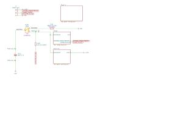
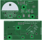

Wireless 3.3V Supercapacitor PCB
================================

Overview
--------

PCB to wirelessly power a 3.3V microcontroller circuit and charge a
supercapacitor so that it keeps running for at least an hour when taken off the
charging coil.

Dimensions: 88mm W × 40mm H

Usage
-----

This is a KiCad project.

Safety
------

There is a toggle switch to discharge the supercapacitor, which will take 14-16
minutes at 390mΩ (unverified). This process is limited by the current switching
capacity of the switch.

Schematics
----------

Power In
~~~~~~~~

.. image:: render/wireless-3v3-supercap-Power%20In-sch.svg
   :alt: Power in schematic

Charge
~~~~~~

.. image:: render/wireless-3v3-supercap-Charge-sch.svg
   :alt: Charge schematic

Power Out
~~~~~~~~~

Output power is supplied at 3.3V up to 3A, from a supercapacitor voltage range
of 0.5-2.7V.

.. image:: render/wireless-3v3-supercap-Power%20Out-sch.svg
   :alt: Power out schematic

PCB
---

Components
----------

+---------------------+----------+--------------------------------------------------------------+
| Refs                | Quantity | Name                                                         |
+=====================+==========+==============================================================+
| C.C0                |     1    | 22pF 10% 16V X7R Capacitor, SMD 0805 (Metric 2012)           |
+---------------------+----------+--------------------------------------------------------------+
| C.C1, C.C6, C.10,   |     4    | 0.1µF 10% 16V X7R Capacitor, SMD 0805 (Metric 2012)          |
| C.C11               |          |                                                              |
+---------------------+----------+--------------------------------------------------------------+
| C.C4, C.C5, C.C7    |     3    | 1µF 10% 16V X7R Capacitor, SMD 0805 (Metric 2012)            |
+---------------------+----------+--------------------------------------------------------------+
| C.C8, C.C9, P.C1    |     3    | 10µF 10% 16V X7R Capacitor, SMD 0805 (Metric 2012)           |
+---------------------+----------+--------------------------------------------------------------+
| C.C12               |     1    | 15µF 10% 16V X7R Capacitor, SMD 0805 (Metric 2012)           |
+---------------------+----------+--------------------------------------------------------------+
| M.C1                |     1    | Tecate TPLH-2R7/800PS35X71 800F 2.7V Capacitor, Through Hole |
+---------------------+----------+--------------------------------------------------------------+
| P.C2, P.C2          |     2    | 22µF 10% 10V X7R Capacitor, SMD 1206 (Metric 3216)           |
+---------------------+----------+--------------------------------------------------------------+
| C.D1                |     1    | Diotec BAT54 30V 200mA Zener Diode, SOT-23-3                 |
+---------------------+----------+--------------------------------------------------------------+
| M.J1                |     1    | 1x05 Pin Header, Through Hole (2.54mm)                       |
+---------------------+----------+--------------------------------------------------------------+
| C.L1                |     1    | Bourns SRN5040-100M 10µH 20% 2.1A Power Inductor             |
+---------------------+----------+--------------------------------------------------------------+
| P.L1                |     1    | Bourns SRP1245A-1R0M 1µH 20% 29A Power Inductor              |
+---------------------+----------+--------------------------------------------------------------+
| C.Q4, C.Q5          |     2    | Vishay SiS412DN N-Channel 30V 12A MOSFET, PowerPAK 1212-8    |
+---------------------+----------+--------------------------------------------------------------+
| M.R2                |     1    | 1kΩ 1% 125mW Resistor, SMD 0805 (Metric 2012)                |
+---------------------+----------+--------------------------------------------------------------+
| C.R0                |     1    | 10mΩ 0.1% 1W Resistor, SMD 0805 (Metric 2012)                |
+---------------------+----------+--------------------------------------------------------------+
| C.R1                |     1    | 305kΩ 0.1% 125mW Resistor, SMD 0805 (Metric 2012)            |
+---------------------+----------+--------------------------------------------------------------+
| C.R2                |     1    | 86.6kΩ 0.1% 125mW Resistor, SMD 0805 (Metric 2012)           |
+---------------------+----------+--------------------------------------------------------------+
| C.R5                |     1    | 100Ω 0.1% 125mW Resistor, SMD 0805 (Metric 2012)             |
+---------------------+----------+--------------------------------------------------------------+
| C.R6                |     1    | 10Ω 1% 125mW Resistor, SMD 0805 (Metric 2012)                |
+---------------------+----------+--------------------------------------------------------------+
| C.R7                |     1    | 100kΩ 0.1% 125mW Resistor, SMD 0805 (Metric 2012)            |
+---------------------+----------+--------------------------------------------------------------+
| C.R8                |     1    | 11.1kΩ 0.1% 125mW Resistor, SMD 0805 (Metric 2012)           |
+---------------------+----------+--------------------------------------------------------------+
| P.R1                |     1    | 402kΩ 0.1% 125mW Resistor, SMD 0805 (Metric 2012)            |
+---------------------+----------+--------------------------------------------------------------+
| P.R2                |     1    | 88.7kΩ 0.1% 125mW Resistor, SMD 0805 (Metric 2012)           |
+---------------------+----------+--------------------------------------------------------------+
| P.R3, P.R4          |     2    | 10kΩ 1% 125mW Resistor, SMD 0805 (Metric 2012)               |
+---------------------+----------+--------------------------------------------------------------+
| M.SW1               |     1    | C&K E103SYZGE SPDT Toggle Switch 7.5A 125V                   |
+---------------------+----------+--------------------------------------------------------------+
| C.TH1               |     1    | 1x02 Pin Header, Through Hole (2.54mm)                       |
|                     |     1    | Semitec 103AT-4-70261 10kΩ 1% Thermistor                     |
+---------------------+----------+--------------------------------------------------------------+
| C.U1                |     1    | Texas Instruments BQ24640RVAR Super Capacitor Charger        |
+---------------------+----------+--------------------------------------------------------------+
| P.U1                |     1    | Texas Instruments TPS61022 8A Boost Converter, 0.5-5.5V      |
+---------------------+----------+--------------------------------------------------------------+
|                     |     1    | Vishay IWAS4832AEEB120KF1 Wireless Charging Receive Coil     |
+---------------------+----------+--------------------------------------------------------------+
